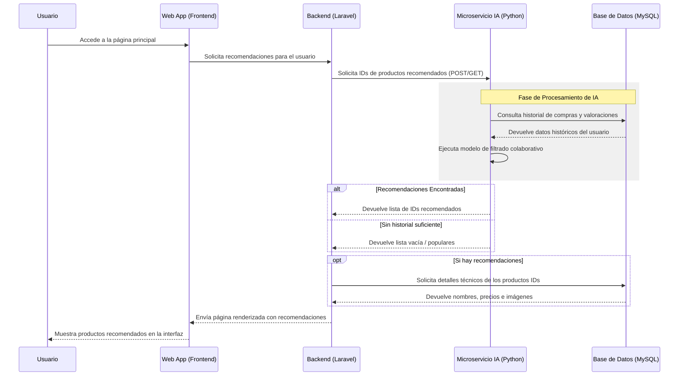
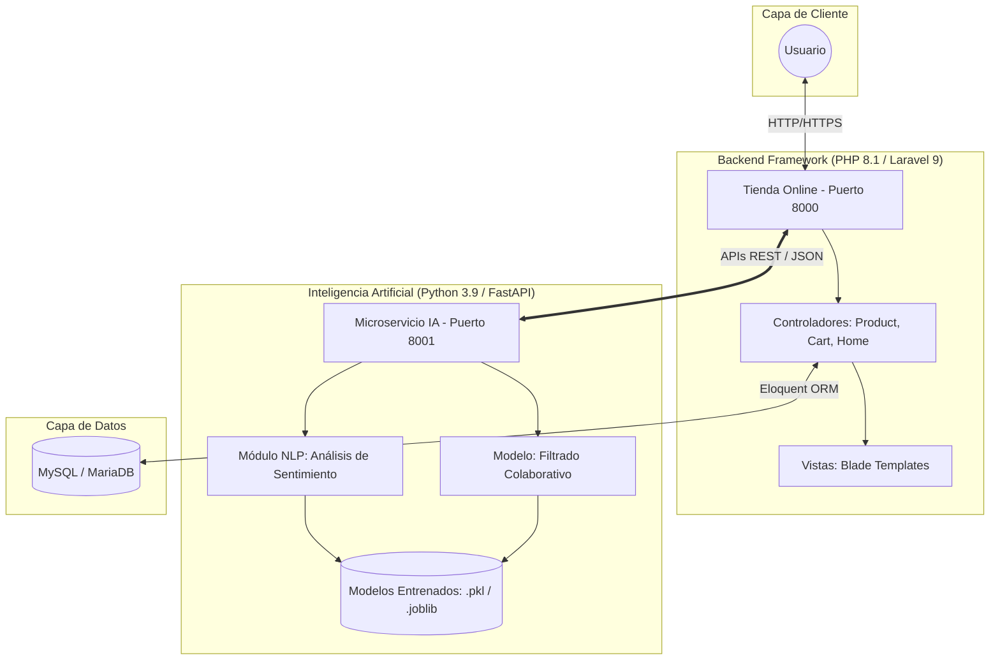
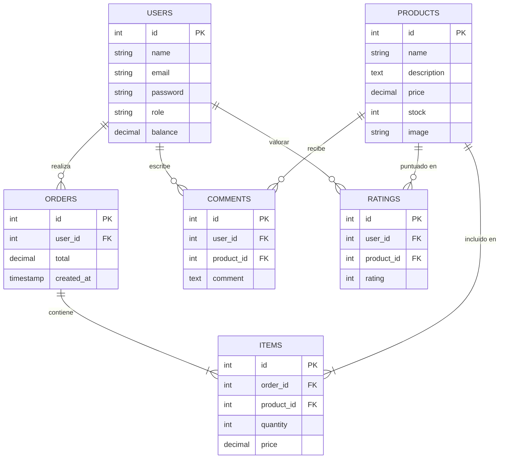

# Diagramas del Sistema - TFM

Este documento contiene la representación visual de la arquitectura, el flujo de datos y el modelo de base de datos del proyecto.

## 1. Diagrama de Secuencia (Flujo de Recomendación)
Este diagrama describe cómo interactúa el usuario con la plataforma y cómo el backend de Laravel se comunica con el microservicio de IA para obtener recomendaciones personalizadas.

---

## 2. Arquitectura de Componentes
Representación de la infraestructura desacoplada entre el núcleo transaccional y el motor de inteligencia artificial.

---

## 3. Modelo Entidad-Relación (ER)
Estructura de datos optimizada para el ecommerce y la alimentación de los modelos de Machine Learning.

